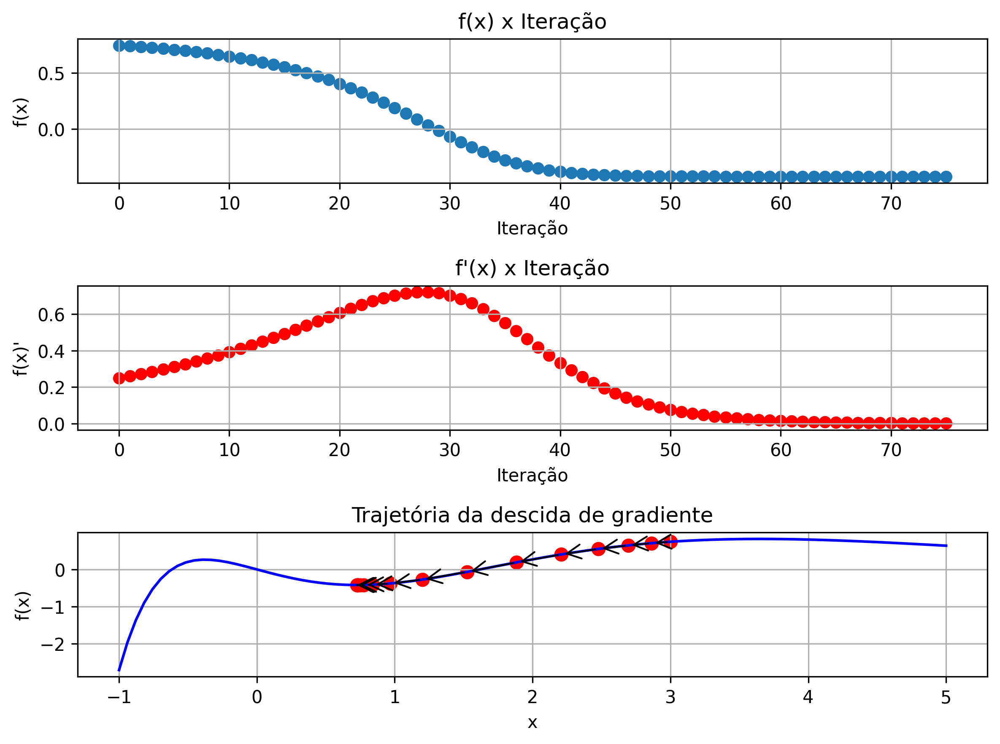
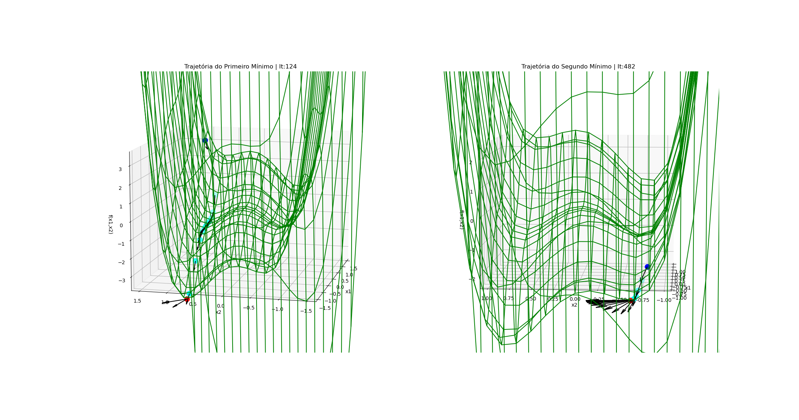
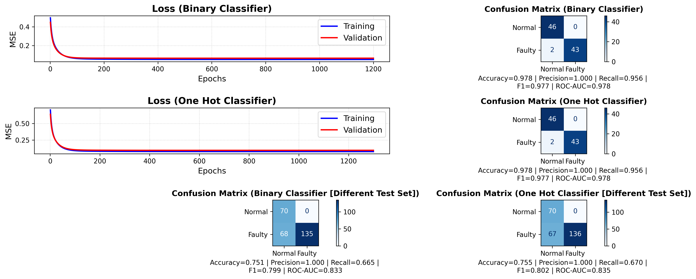

# Como rodar o código

O codigo fez o uso do [uv](https://docs.astral.sh/uv/getting-started/installation/) para a criação do ambiente python. Antes de tentar rodar os códigos instale o uv.

# Primeiro Trabalho

Primeiro mude de diretório:
```
cd ./trab1
```

Sincronize o ambiente uv, ele irá instalar todas as dependências:
```
uv sync
```

Para executar os arquivos basta usar:
```
uv run python3 {arquivo}
```

Neste caso, para executar os arquivos do primeiro trabalho:
```
uv run python3 part1.py
uv run python3 part2.py
uv run python3 part3.py
uv run python3 part4.py
```

# Resultados do Primeiro Trabalho

Gŕafico do uso da descida de gradiente na função 2D dada:



Gŕafico do uso da descida de gradiente na função 3D dada, 'caindo' em 2 mínimos diferentes da função:



# Segundo Trabalho

Primeiro mude de diretório:
```
cd ./trab2
```

Sincronize o ambiente uv, ele irá instalar todas as dependências:
```
uv sync
```

Para executar os arquivos basta usar:
```
uv run python3 {arquivo}
```

Neste caso, para executar os arquivos do segundo trabalho:
```
uv run python3 main.py
```

# Resultados do Segundo Trabalho

Gŕafico do treinamento do modelo linear utilizando o gradiente descendente:



## Conclusão

O modelo linear com somente uma saída binária e o modelo linear one-hot são equivalentes quando os dados de teste se parecem com os dados de treino. Porém quando as características da falha (Valor, TC e Delay) são diferentes do teste de treino, o modelo linear one-hot é marginalmente melhor. Em diferentes testes realizados, o modelo one-hot obteve resultados iguais ou melhores que o modelo binário.

Isso pode significar que o hiper-plano no modelo linear one-hot conseguiu uma fronteira de decisão que apresentou melhor capacidade de generalização nos testes realizados.

Os altos valores das métricas podem sigfinicar que o modelo de simulação do CSTR já utiliza aproximações lineares, ou seja, há uma relação linear entre as variáveis envolvidas e a saída, por mais que o ruído gaussiano esteja presente na simulação, favorecendo o desempenho de ambos modelos.  
